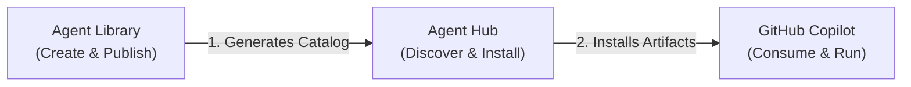

# Agent Library

Enterprise scaffold for publishing your internal AI artifacts: chatmodes, prompts, instructions, and tasks. Ship a browsable catalog site and a VS Code integration in minutes.

- [](https://marketplace.visualstudio.com/items?itemName=nimsbhai.agent-hub)

- Works with the Agent Hub VS Code extension to search and install artifacts.
- Generates a standards-based `copilot-catalog.json` consumable from GitHub, GitLab, or your static frontend.
- Strict TypeScript, Zod validation, and CI-ready.

Marketplace page for the extension: `https://marketplace.visualstudio.com/items?itemName=nimsbhai.agent-hub`

## TL;DR Quickstart

**Live Example:** [https://nimeshgurung.github.io/agent-library/](https://nimeshgurung.github.io/agent-library/)

```bash
# 1) Install deps (root + frontend)
npm run bootstrap

# 2) Generate artifacts (pick any)
npm run generate:chatmode
npm run generate:prompt
npm run generate:instructions
npm run generate:task
npm run generate:agent   # directory-style agent packs of multiple artifacts/resources

# 3) Build catalog + frontend
npm run build

# 4) Run locally
npm run dev
# Open http://localhost:5173 — browse artifacts, copy settings snippet, etc.
```

Add the catalog to VS Code (Agent Hub extension):

```json
{
  "agentHub.repositories": [
    {
      "id": "agent-library",
      "url": "https://<your-host>/copilot-catalog.json",
      "enabled": true
    }
  ]
}
```

See “Extension Integration” for more options (GitHub/GitLab raw URLs, auth).

## How Agent Library + Agent Hub fit together



- Agent Library helps you scaffold, validate, and publish your artifacts along with a React catalog site.
- The Agent Hub VS Code extension lets your team search and install artifacts from your catalog(s) directly in VS Code.
- You can host the catalog via:
  - Static frontend at `/copilot-catalog.json`
  - GitHub Raw: `https://raw.githubusercontent.com/<org>/<repo>/<branch>/copilot-catalog.json`
  - GitLab Raw: `https://gitlab.com/<org>/<repo>/-/raw/<branch>/copilot-catalog.json`

The frontend includes a floating “View copilot-catalog.json” button and can auto-detect the first reachable catalog URL via env vars (`VITE_CATALOG_FRONTEND_URL`, `VITE_CATALOG_GITHUB_URL`, `VITE_CATALOG_GITLAB_URL`).

## Repo Layout

```
agent-library/
├── artifacts/              # Your artifacts
│   ├── chatmodes/
│   ├── prompts/
│   ├── instructions/
│   ├── tasks/
│   ├── agents/            # Directory-based agent packs (multi-artifact kits)
│   └── index.json         # Unified index (generated)
├── frontend/               # Vite + React catalog UI
│   ├── public/
│   └── src/
├── scripts/                # Generators + tooling
│   ├── generators/
│   ├── generate-catalog.ts
│   └── sync-artifacts.ts
├── schema/                 # Zod + JSON Schemas
├── .gitlab-ci.yml          # GitLab Pages
└── .github/workflows/      # GitHub Actions
```

## Commands

Generators:

- `npm run generate:chatmode`
- `npm run generate:prompt`
- `npm run generate:instructions`
- `npm run generate:task`
- `npm run generate:agent` # scaffold a directory-style agent pack under artifacts/agents/

Management:

- `npm run list:artifacts`
- `npm run delete:artifact -- --id <artifact-id> [--yes]`

Build + Dev:

- `npm run generate:catalog`
- `npm run sync`
- `npm run build`
- `npm run dev`
- `npm run lint`
- `npm run typecheck`
- `npm run format` / `npm run format:write`

## Artifact Types

Chatmode

```
artifacts/chatmodes/{slug}/
├── {slug}.chatmode.md
└── metadata.json
```

Prompt

```
artifacts/prompts/{slug}/
├── {slug}.prompt.md
└── metadata.json
```

Instructions

```
artifacts/instructions/{slug}/
├── {slug}.instructions.md
└── metadata.json
```

Task

```
artifacts/tasks/{slug}/
├── {slug}.task.md
└── metadata.json
```

Agent Pack

```
artifacts/agents/{slug}/
├── README.md                 # primary entrypoint shown in Agent Hub
├── resources/
│   ├── .github/agents/...    # agent definitions (projected to workspace root)
│   ├── .github/prompts/...   # prompts (projected to workspace root)
│   ├── .vscode/settings.json # workspace settings (applied at workspace root)
│   └── ...                   # arbitrary resources/templates/scripts
└── metadata.json
```

All **additional files** inside `artifacts/*/{slug}/` are auto-discovered when you run `npm run generate:catalog` and surfaced as `supportingFiles` in `copilot-catalog.json`, so Agent Hub can download the full structure without extra wiring.

## CI/CD

We include pipelines for GitHub Actions and GitLab CI that:

1. Generate the catalog, 2) Build the frontend, 3) Publish Pages.

- GitHub Pages: `https://<your-org>.github.io/<repo>`
- GitLab Pages: `https://<your-org>.gitlab.io/<repo>`

See docs/ci-cd.md for complete examples and configuration.

## Documentation

- docs/overview.md — high-level concept and repo layout
- docs/quickstart.md — step-by-step guide
- docs/generators.md — CLI usage for all artifact types
- docs/catalogs-and-hosting.md — `copilot-catalog.json`, hosting, and env fallback
- docs/ci-cd.md — GitHub Actions + GitLab CI
- docs/extension-integration.md — VS Code extension setup + settings
- docs/private-catalogs.md — private repos + auth patterns
- docs/troubleshooting.md — common errors and fixes

## Screenshots (placeholders)

- Catalog grid (docs/images/catalog-grid.png)
- Artifact detail (docs/images/artifact-detail.png)
- VS Code settings snippet (docs/images/settings-json.png)

## License

MIT

## Links

- Marketplace (Agent Hub extension): `https://marketplace.visualstudio.com/items?itemName=nimsbhai.agent-hub`
- Agent Hub repo docs: `https://github.com/artifact-hub/artifact-hub`
